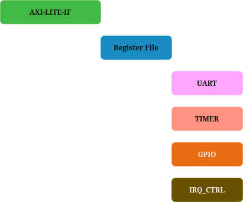

# 🚀 AXI-Lite Multi-Functional Peripheral

This reposityory provides AXI-Lite based multifunctional peripherals that includes UART + TIMER + GPIO. Main purpose of this project is applying industrial verification techniques to IPs.

---

## 🧩 Project Specs.

    - AXI4-Lite compliant slave
    - 32-bit data bus
    - 4 KB address space
    - UART with programmable baud-rate
    - Timer with interrupt
    - GPIO with input/output

## Register Map

|Offset|Name|Description|
|:---:|:---:|:---:|
|0x00|CTRL|    Global control register. Enables or disables UART, TIMER, and GPIO submodules.|
|---|---|---|
|0x04|STATUS|    Status flags indicating current state of UART and TIMER.|
|---|---|---|
|0x08|IRQ_ENABLE|    Interrupt enable register for UART and TIMER interrupts.|
|---|---|---|
|0x0C|IRQ_STATUS|    Interrupt status register. Indicates pending interrupt sources. Writing '1' clears the corresponding interrupt.
|---|---|---|
|0x10|UART_BAUD|    UART baud-rate configuration register. Defibes baud-rate divider value.|
|---|---|---|
|0x14|UART_TXDATA|    UART transmit data register. Writing a byte initiates transmission.|
|---|---|---|
|0x18|UART_RXDATA|    UART receive data register. Reading returns the last received byte.|
|---|---|---|
|0x1C|UART_STATUS|    UART status register indicating TX busy, RX valid, and error flags.|
|---|---|---|
|0x20|TIMER_LOAD|    Timer load value register. Defines the initial countdown value.|
|---|---|---|
|0x24|TIMER_VALUE|    Current timer counter value. Read-only.|
|---|---|---|
|0x28|TIMER_CTRL|    Timer control register. Enables timer, selects mode (one-shot/ periodic).|
|---|---|---|
|0x2C|GPIO_DIR|    GPIO direction register. '1' = output, '0' = input.|
|---|---|---|
|0x30|GPIO_OUT|    GPIO output data register. Controls output pin values.|
|---|---|---|
|0x34|GPIO_IN|    GPIO input data register. Reflects current input pin states.|
|---|---|---|

## Block Diagram

